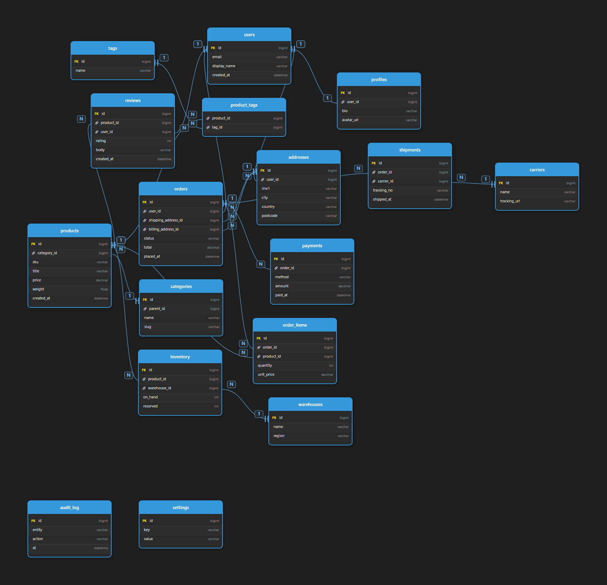
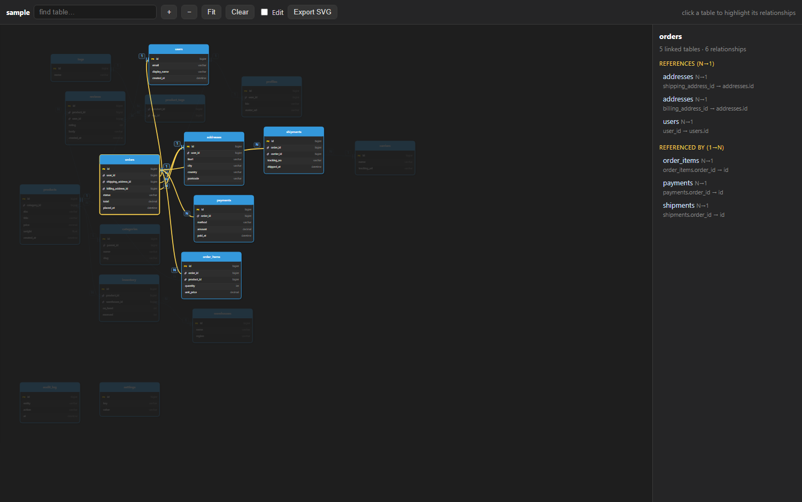
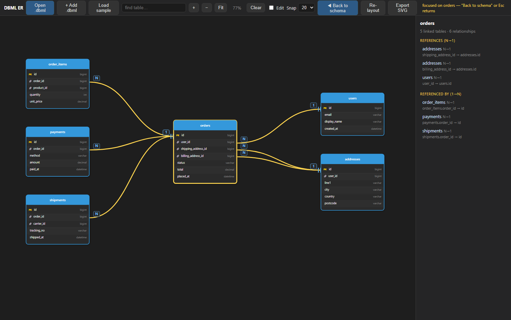

# dbml-er-viewer

Turn a [DBML](https://dbml.dbdiagram.io/) schema into an **untangled, interactive ER diagram** — a single self-contained HTML file you open in any browser.

No grid of alphabetically-ordered tables with relationship lines crossing the whole page. A force-directed layout pulls linked tables side-by-side and aligns them by the row their key sits on, so the connections stay **short and mostly horizontal**, with as few crossings as possible.



## Why

Auto-generated ER diagrams usually drop tables onto a grid in name order. With a few hub tables (a `users`, an `orders`, a giant central table) the relationship lines turn into spaghetti and you can't tell where a link actually goes.

This tool re-lays-out the schema from the source and ships a viewer where you can **click a table to light up only its relationships** — everything else dims, and a side panel lists exactly which columns link to which table.



Need a closer look at one table? Double-click it — what points at it on the left, what it points to on the right, everything else out of the way. `Esc` brings the schema back.



## Features

- **Untangled layout** — force-directed placement; multiple random seeds are tried and the one with the fewest line crossings wins. Hub tables drift to the center, satellites cluster around them, isolated tables get their own tidy row.
- **Click to highlight** — select a table and only its links stay lit; the rest fades. A side panel shows linked tables split into *References (N→1)* and *Referenced by (1→N)*, each with the exact `column → table.column`.
- **Focus one table** — double-click a table (or select it and hit **Focus**) to see it on its own, laid out for reading: the table in full in the middle, everything that *points at it* on the left, everything it *points to* on the right, all other tables and lines hidden. Neighbours are drawn as **compact cards showing only the linking column**, and they are packed into as many columns as it takes to keep the view screen-shaped — a hub with 45 links stays a readable 2880×1800 instead of a 16000px strip. **Click a link (or the card) to open that table in full** and click again to fold it back — the view stays put while you look. Double-click a neighbour (or click it in the side panel) to make it the new centre. **Back to schema** or **Esc** returns to the full diagram exactly as you left it — positions, manual placement, selection and zoom/pan. Exporting while focused writes just that neighbourhood.
- **Heatmap from a stats.json** - colour the tables by **rows**, **write activity** or **size**: a strip under each header plus the value, on a logarithmic scale (a 10-row lookup and a 100M-row log have to stay distinguishable). Drop a `stats.json` next to the schema - no server, no credentials, nothing leaves the machine. Table names are matched loosely (`public.orders`, `"Orders"`, `ORDERS` all find `orders`) and you get a report: *matched 62/78 - 16 without data - 2 unknown names*. Ready-made queries that emit the JSON straight out of the database live in [`sql/`](sql/).
- **Search** any table by name and jump to it.
- **Navigation** — zoom with the mouse wheel (centred on the cursor), pan by dragging the canvas (left button on empty space, or middle button anywhere) — the view follows the cursor like a hand tool. No scrollbars; `+` / `−` / `Fit` buttons too.
- **Merge several .dbml files** — drop more files (or **+ Add .dbml**) to grow the diagram: new tables are drawn in, tables that already exist are *updated, not duplicated*, and duplicate relationships are dropped. **The later file wins**, so re-exporting a changed schema on top of the current one just refreshes it. Existing tables keep their position — only the newcomers get placed, next to whatever they link to.
- **Edit mode** — drag tables around; the relationship lines re-route live. A **Snap** step (10/20/26/50 px, with a faint grid) keeps manual placement aligned without pixel-fiddling.
- **Re-layout** — recompute the whole arrangement from scratch when you want a fresh untangle.
- **Export SVG** — save the current (possibly edited) diagram as a static `.svg`.
- **Cardinality markers** — crow's-foot for *many*, bar for *one*; supports `>`, `<`, `-` (one-to-one) and `<>`.
- **PK / FK badges** — primary keys get a gold `PK`; columns used in a relationship get a 🔗.

## Two ways to use it

### 1. In the browser — no install, no Python

Open **[`index.html`](index.html)** in any browser and **drag a `.dbml` file onto it** (or click *Open .dbml*). Parsing, layout and rendering all happen client-side in JavaScript — nothing is uploaded anywhere, nothing to install. It loads a sample on first open so you can try it immediately.

> Tip: you can host `index.html` on GitHub Pages and share a link, or just keep the file locally and double-click it.

### 2. From the command line — Python

For batch use / CI. **Python 3.8+**, standard library only, nothing to `pip install`.

```bash
python dbml_to_er.py schema.dbml
```

Several files are merged into one diagram, later file wins on duplicates:

```bash
python dbml_to_er.py core.dbml extras.dbml newer.dbml
```

writes next to the first input:

| file | what it is |
|------|------------|
| `schema.html` | interactive viewer (open in a browser) |
| `schema.svg`  | static untangled diagram |

Options:

```text
-o, --out NAME    output basename (default: input name)
    --seeds N     layout attempts; more = fewer crossings, slower (default 10)
    --no-svg      skip the static .svg
    --no-html     skip the interactive .html
-q, --quiet       no progress output
```

Try it on the bundled example:

```bash
python dbml_to_er.py examples/sample.dbml --seeds 16
```

Both paths share the same DBML parser and force-directed layout — the Python script and `index.html` are direct ports of each other.

## Where stats.json comes from

Nothing to install: the database can build the JSON itself. Run the query for
your engine, save the single returned cell as `stats.json`, and drop that file
onto the diagram.

| engine | snapshot | over a period |
|---|---|---|
| PostgreSQL | [`sql/postgres_now.sql`](sql/postgres_now.sql) | [`sql/postgres_period.sql`](sql/postgres_period.sql) |
| SQL Server | [`sql/sqlserver_now.sql`](sql/sqlserver_now.sql) | [`sql/sqlserver_period.sql`](sql/sqlserver_period.sql) |
| MySQL / MariaDB | [`sql/mysql_now.sql`](sql/mysql_now.sql) | — |

On SQL Server the result shows up as a link in the SSMS grid — click it to get
the full text. To write the file directly instead:

```text
sqlcmd -S SERVER -d BASE -E -i sql\sqlserver_now.sql -o stats.json -y 0 -h -1
```

Both the object form (`"tables": { "orders": {...} }`) and the list form that
`FOR JSON PATH` produces (`"tables": [ { "table": "orders", ... } ]`) are
accepted.

```json
{
  "period": "2025-09-01 .. 2026-09-01",
  "tables": {
    "orders":    { "rows": 1450000,  "writes": 12034567, "size": 820 },
    "audit_log": { "rows": 58000000, "writes": 85000000, "size": 3300 }
  }
}
```

`size` is in MB. Key aliases are accepted (`rowCount`, `row_count`, `n_live_tup`,
`total_writes`, `size_mb`, ...), so output from your own query usually just works,
and any metric you leave out simply gets no colour.

**About periods.** A database keeps no history of its own: `pg_stat_user_tables`
holds counters accumulated since the last `pg_stat_reset()`, SQL Server's
`user_updates` resets when the service restarts, and sizes are instantaneous. To get *"activity over the last year"* you have to collect
snapshots and subtract one from another -
[`sql/postgres_period.sql`](sql/postgres_period.sql) sets that up: a snapshot
table, a one-line insert to run on a schedule, and a query that turns any two
dates into a `stats.json`. If you already run monitoring (Zabbix, Prometheus +
postgres_exporter, pgwatch, Performance Insights), export from there instead -
the viewer only cares about the JSON shape above.

## DBML support

Parses the common DBML constructs:

- `Table name { column type [settings] }` — with `schema.table` and `as alias`.
- Column settings: `[pk]` / `[primary key]`, and inline `[ref: > other.table.col]`.
- `Ref:` short form and `Ref { ... }` block form, operators `>`, `<`, `-`, `<>`.
- Composite ref endpoints `Table.(a, b)` (the first column is used as the anchor).
- `Project`, `Enum`, `TableGroup`, `Note` blocks are skipped.
- Input is read as UTF-8 / UTF-16 / CP1251 automatically.

## How the layout works

1. Each table becomes a card whose height comes from its column count; relationships are anchored to the exact row of the key column.
2. A force-directed pass runs over the connected tables:
   - **edge attraction** aligns the two anchor rows vertically (links become near-horizontal) and keeps linked tables a fixed gap apart horizontally;
   - **box-aware repulsion** keeps cards from piling up.
3. A hard overlap-removal pass guarantees no two cards touch.
4. Steps 2–3 run for several random seeds; the layout with the fewest straight-line crossings is kept.
5. Isolated tables (no relationships) are packed into a separate row so they don't clutter the core.

On the bundled 17-table example this brings line crossings down to ~1.

## License

MIT — see [LICENSE](LICENSE).
